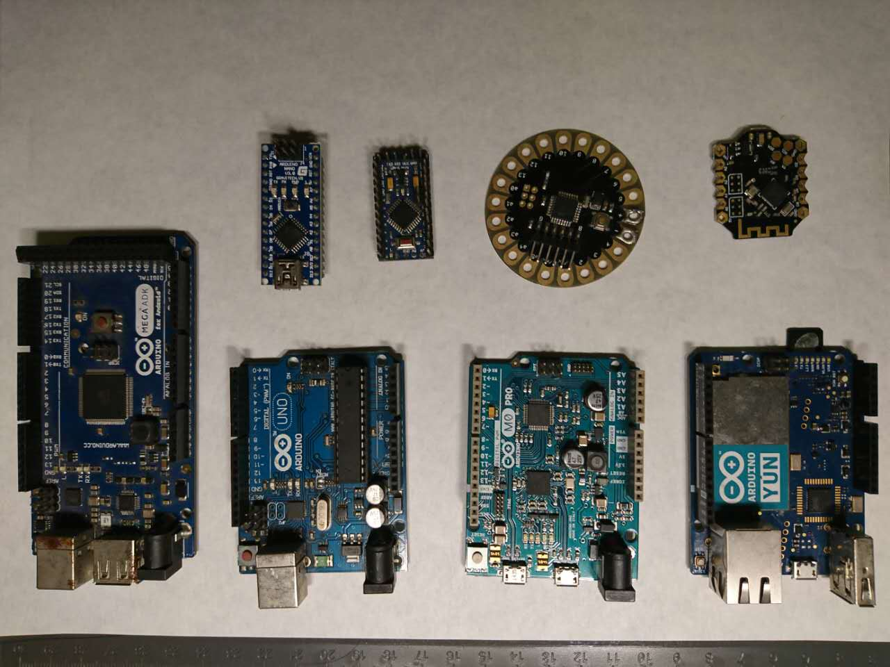
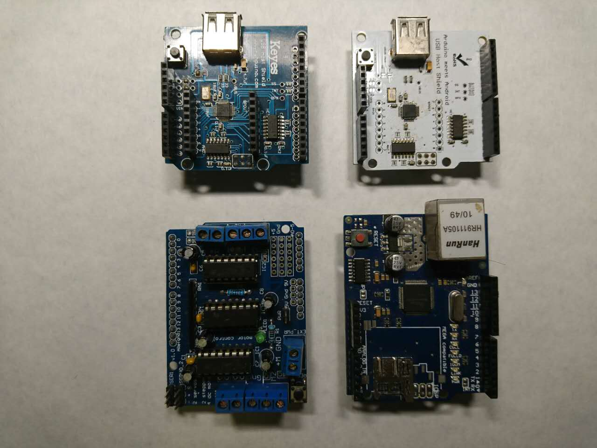
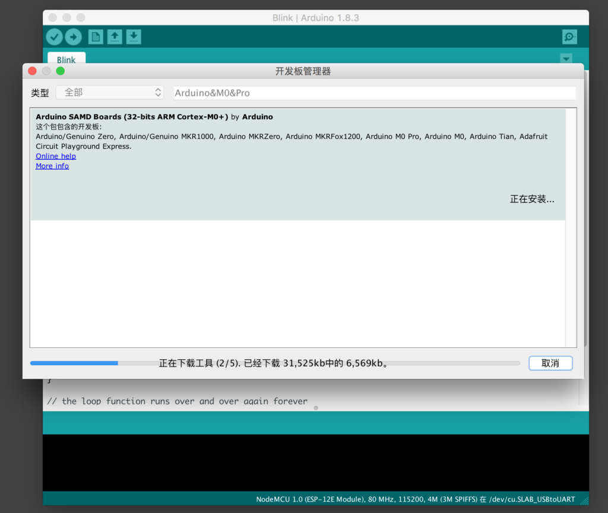
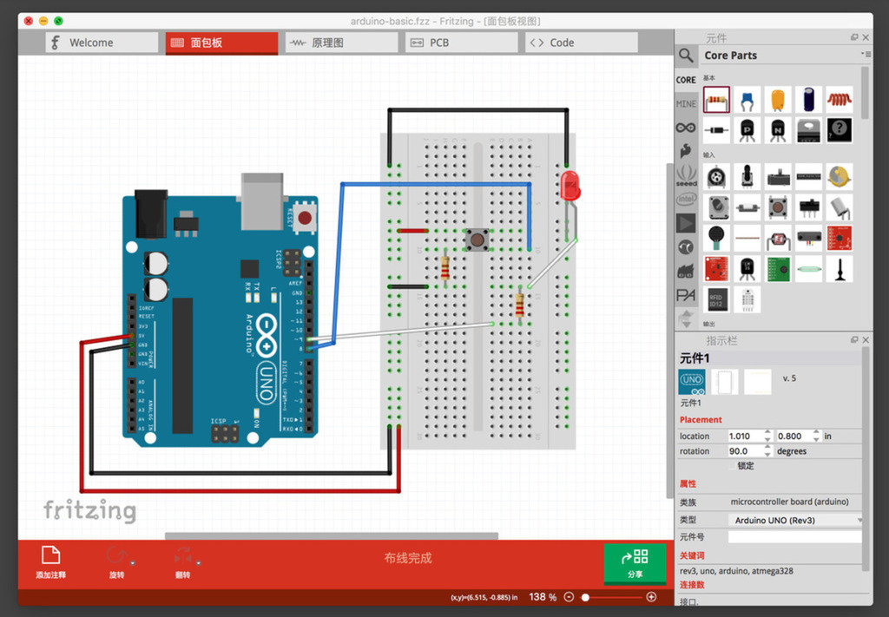
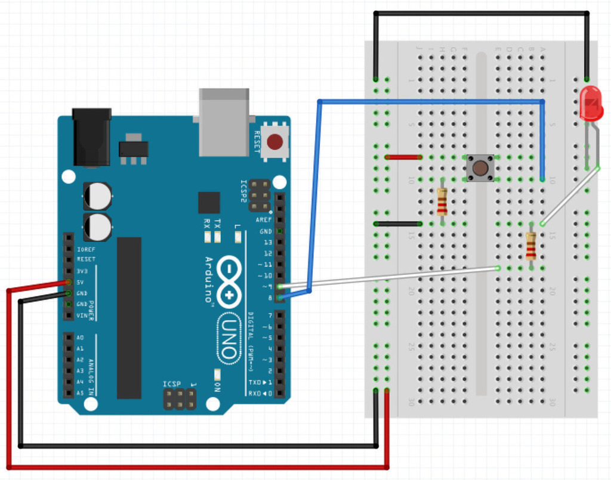
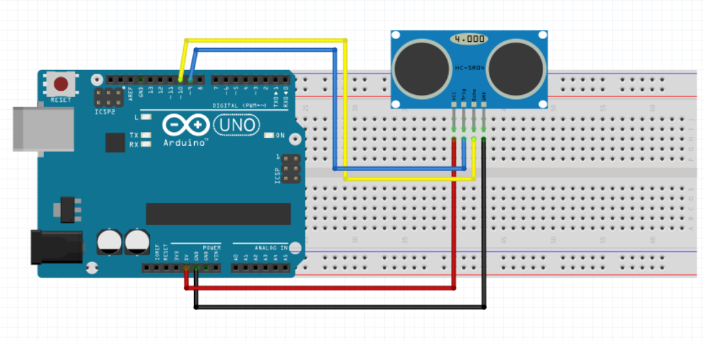
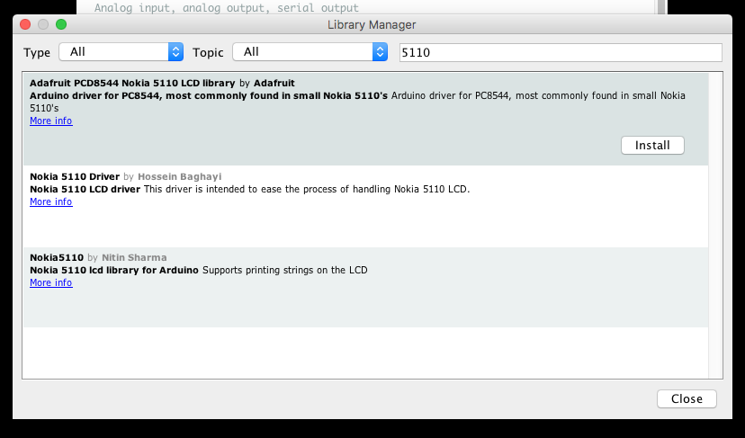

前言
===

最近这些日子里，当我和女朋友搬到了新的合租屋里，有了更大的空间——可以再次折腾硬件。便开始去玩一些硬件家居相关的内容，也顺便接上了 Amazon Echo、小米传感器、Broadlink、ESP8266 等等的硬件。

再加上正在编写的『玩点什么』网站，便也想整理一下硬件相关的资料。想着想着，便有了这一系列的电子书。

这是一本写给软件工程师看的硬件指南。

关于作者
---

黄峰达（Phodal Huang）是一个创客、工程师、咨询师和作家。他毕业于西安文理学院电子信息工程专业，现作为一个咨询师就职于 ThoughtWorks 深圳。长期活跃于开源软件社区 GitHub，目前专注于物联网和前端领域。

作为一个开源软件作者，著有 Growth、Stepping、Lan、Echoesworks 等软件。其中开源学习应用 Growth，广受读者和用户好评，可在 APP Store 及各大 Android 应用商店下载。

作为一个技术作者，著有《自己动手设计物联网》（电子工业出版社）、《全栈应用开发：精益实践》（电子工业出版社，正在出版）。并在 GitHub 上开源有《Growth: 全栈增长工程师指南》、《GitHub 漫游指南》等七本电子书。

作为技术专家，他为英国 Packt 出版社审阅有物联网书籍《Learning IoT》、《Smart IoT》，前端书籍《Angular 2 Serices》、《Getting started with Angular》等技术书籍。

他热爱编程、写作、设计、旅行、hacking，你可以从他的个人网站：[https://www.phodal.com/](https://www.phodal.com/) 了解到更多的内容。

其它相关信息：

 - 微博：[http://weibo.com/phodal](http://weibo.com/phodal)
 - GitHub： [https://github.com/phodal](https://github.com/phodal)
 - 知乎：[https://www.zhihu.com/people/phodal](https://www.zhihu.com/people/phodal)
 - SegmentFault：[https://segmentfault.com/u/phodal](https://segmentfault.com/u/phodal)

当前为预览版，在使用的过程中遇到任何问题请及时与我联系。阅读过程中的问题，不妨在GitHub上提出来： [Issues](https://github.com/phodal/fe/issues)

阅读过程中遇到语法错误、拼写错误、技术错误等等，不妨来个Pull Request，这样可以帮助到其他阅读这本电子书的童鞋。

其他电子书：

 * 《[Phodal's Idea实战指南](https://github.com/phodal/ideabook)》
 * 《[一步步搭建物联网系统](https://github.com/phodal/designiot)》
 * 《[GitHub 漫游指南](https://github.com/phodal/github-roam)》
 * 《[RePractise](https://github.com/phodal/repractise)》
 * 《[Growth: 全栈增长工程师指南](https://github.com/phodal/growth-ebook)》
 * 《[Growth: 全栈增长工程师实战](https://github.com/phodal/growth-in-action)》 
 * 《[我的职业是前端工程师](http://github.com/phodal/fe)》

基础篇
===

Arduino vs ESP8266 vs Raspberry Pi
---

在这一系列的文章里，我们使用三个主要的开发板：

 - Arduino。
 - ESP8266。
 - Raspberry Pi。

这三个硬件分别代表着，三种不同类型的硬件爱好者的开发板。

### Arduino

> Arduino，是一个开放源代码的单片机微控制器，它使用了Atmel AVR单片机，采用了开放源代码的软硬件平台，建构于简易输出/输入（simple I/O）接口板，并且具有使用类似Java、C语言的Processing/Wiring开发环境。[^wiki_arduino]

[^wiki_arduino]: 源自维基百科，https://zh.wikipedia.org/wiki/Arduino

其包含了以下的特性[^wiki_arduino]:

 - 基于知识共享开放源代码的电路图设计。
 - 免费下载，也可依需求自己修改，但需遵照姓名标示。您必须按照作者或授权人所指定的方式，表彰其姓名。
 - 依相同方式分享，若您改变或转变著作，当散布该派生著作时，您需采用与本著作相同或类似的授权条款。
 - Arduino 可使用 ICSP 在线烧入器，将 Bootloader 烧入新的 IC 芯片。
 - 可依据 Arduino 官方网站，获取硬件的设计档，加以调整电路板及组件，以匹配自己实际设计的需求
 - 可简单地与感测器，各式各样的电子组件连接，如红外线、超音波、热敏电阻、光敏电阻、伺服马达…等。
 - 支持多样的交互程序，如Adobe Flash, Max/MSP, VVVV, Pure Data, C, Processing…等。
 - 使用低价格的微处理控制器（Atmel AVR）（ATMEGA 8,168,328等）。
 - USB接口，不需外接电源。另外有提供直流（DC）电源输入。

当然，其最大的特色是，**完善的社区及生态系统**。几乎我们能想到的 Arduino
相关的创意，都可以在网上找到。如果没有的话，那么可能是你的创意不适合用于
Arduino。

Arduino
已然有一系列的相关硬件，就目前而言，最广泛的开发板，或者说是标准开发板是
Arduino UNO。

TODO: 相关 Arduino 硬件介绍

Arduino
最吸引人的是开创性的引入电子积木的概念，即开发板的扩展板可以直接叠加在开发板上使用，而无需额外的硬件。

TODO: 扩展板介绍。

Arduion IDE 基于 Processing 开发环境而开发的。

概念
---

引脚

模电

数电

电流、电阻、电压

etc..

PCB
---

为了更好的向读者展示硬件连线，我们将使用 Fritzing 汇制硬件电路图。

### Fritzing

> Fritzing 是一个开源的硬件计划（initiative），它可以使电子元件变成任何人的创意素材。Fritzing 提供一个软件工具、一个社区网站，以及本着 Processing 和 Arduino 精神的服务，培养创造性的生态系统，允许用户记录他们的原型，与他人分享、用于课堂上的电子相关教学，以及布局和制造专业的pcb。

Fritzing 的官网是：[http://fritzing.org/](http://fritzing.org/)。

因此，在开始之前我们需要在 Fritzing 的官网下载
Fritzing。当前它可以支持主流的操作系统：Windows、Linux、macOS，当然如果你想自己从源码编译一个
Fritzing，那也是可以的。除了中文和英语外，它还支持其它 17 种语言。

在其官网，除了能下载到该软件，还可以看到其它用户上传、汇制的
Fritzing 电路图等，它们可以免费下载，并引用到你的项目中。

LCEDA


硬件
---

Nokia 5110

温度、红外、距离、土壤


MCU vs CPU
---

Input -> MCU -> Output


通讯
---

蓝牙、有线、

专用协议，blabla

第一部分 Arduino 篇
===

 - Arduino + LED + 按钮控制
 - Arduino 读取传感器
 - Arduion + LCD 5100 显示传感器
 - Arduino 蓝牙通讯
 - Arduino Processing 可视化数据
 - Arduino 上传数据
 - Arduino 的可能性：+ Fritzing / Arduino + Johnny-Five

Arduino Hello, World
===

幸运的是，今天对硬件编程已经有了更多的方式，可以使用更高级的语言。除了在 Arduion 上使用 Processing 语言（可以视为 C）进行编程，还可以使用 JavaScript 等语言。我们会在后面的介绍：如何使用这些高级的语言来编程。

开发板选择
---





Arduino IDE 默认会安装相应环境的包，如果你的开发板不在这些环境里，如你使用的是 Arduino M0 开发板。那么，系统可能会检测出来，并自动为你安装相应的环境，如下图所示。



``注意``：安装过程中会下载一系列的工具，在这个过程里，可能会遇到一些“网络问题”。请尝试更换网络，或直到到“墙”的那外一边。

对于非官方的开发板来说，则需要开发者自己手动通过『开发板管理器』来安装，如 ESP8266 开发板。

hello, world
---

与桌面端使用 print、puts、console.log 来输出 Hello, world 不同的是，点亮一个 LED 是 电子世界的 Hello, world。


官方的 Blink 示例如下：

```c
void setup() {
  // initialize digital pin LED_BUILTIN as an output.
  pinMode(LED_BUILTIN, OUTPUT);
}

// the loop function runs over and over again forever
void loop() {
  digitalWrite(LED_BUILTIN, HIGH);   // turn the LED on (HIGH is the voltage level)
  delay(1000);                       // wait for a second
  digitalWrite(LED_BUILTIN, LOW);    // turn the LED off by making the voltage LOW
  delay(1000);                       // wait for a second
}
```

接下来，要做的事情就比较简单了。从工具（ Tools ）中选择对应的开发板和端口，如下图所示：


我这里使用设置是 ``Arduino M0 Pro``，对应的端口是：``/dev/tty.usbmodem1412``。

对于 Windows 用户来说，则是 COM 口——从设备管理器中找到对应的端口。

然后点击菜单中的 -> 号，即上传（Upload，又可以称为烧录）。


再看看你的 Arduion，就发现上面的 LED 正在闪烁——一秒开一秒关。

### setup()

源码中的：

```c
int main(void)
{
    init();
    setup();
    for(;;)
        loop();

    return 0;
}
```

### loop()

输入控制输出
---

GOAL

SMART 原则 

仍然采用的是官方的示例：


官方示例（[Digital Read Serial](https://www.arduino.cc/en/Tutorial/DigitalReadSerial)）代码：

```c
// digital pin 2 has a pushbutton attached to it. Give it a name:
int pushButton = 2;

// the setup routine runs once when you press reset:
void setup() {
  // initialize serial communication at 9600 bits per second:
  Serial.begin(9600);
  // make the pushbutton's pin an input:
  pinMode(pushButton, INPUT);
}

// the loop routine runs over and over again forever:
void loop() {
  // read the input pin:
  int buttonState = digitalRead(pushButton);
  // print out the state of the button:
  Serial.println(buttonState);
  delay(1);        // delay in between reads for stability
}
```

### 电路图

使用 Fritzing 画板时



我们所需要的连线图



Arduino 传感器控制
===

传感器入门
---

> 传感器是一种物理装置或生物器官，能够探测、感受外界的信号、物理条件（如光、热、湿度）或化学组成（如烟雾），并将探知的信息传递给其他装置或器官。“传感器”在新韦式大词典中定义为：“从一个系统接受功率，通常以另一种形式将功率送到第二个系统中的器件”。根据这个定义，传感器的作用是将一种能量转换成另一种能量形式，所以不少学者也用“换能器－Transducer”来称谓“传感器－Sensor”。[^wiki_sensor]

[^wiki_sensor] : https://zh.wikipedia.org/wiki/%E4%BC%A0%E6%84%9F%E5%99%A8

### 模拟元件与数字元件


超声波传感器
---





控制继电器
---


Arduino 5110 显示
===

LCD
---

安装库
---



输出 hello, world
---

Arduino Processing
===

串口输出
---


复杂的例子：MPU 6050
---


Arduino BLE 控制
===

蓝牙串口
---

Bluno 等自带蓝牙的开发板


与手机通讯
---

React Native / Cordova ???


Arduino 扩展板使用
===

I don't know

继电器
---

网络
---

Arduino ESP8266 WiFi
===

ESP8266 设置
---


Arduino WiFi
---

第二部分 ESP8266
===

 - ESP8266 基础 + 连接 WiFi / NodeMCU
 - ESP8266 Arduino IDE ??
 - ESP8266 上传 Arduino 数据
 - ？ ESP8266 读取传感器（ADC？）），并上传数据
 - ESP8266 MQTT 示例
 - ESP8266 作为 HTTP 服务器示例
 - 更多的可能性探索：Mongoose OS、Johnny-Five、智能家居

ESP8266 基础
===

设置与 AT 指令
---


NodeMCU
---


ESP8266 Arduino IDE 展示
===

ESP8266 连接 Arduino UNO
===


ESP8266 上传传感器数据
===

### ADC 数据

### 发送请求

```c
/**
 * BasicHTTPClient.ino
 *
 *  Created on: 24.05.2015
 *
 */

#include <Arduino.h>

#include <ESP8266WiFi.h>
#include <ESP8266WiFiMulti.h>

#include <ESP8266HTTPClient.h>

#define USE_SERIAL Serial

ESP8266WiFiMulti WiFiMulti;

void setup() {

    USE_SERIAL.begin(115200);
   // USE_SERIAL.setDebugOutput(true);

    USE_SERIAL.println();
    USE_SERIAL.println();
    USE_SERIAL.println();

    for(uint8_t t = 4; t > 0; t--) {
        USE_SERIAL.printf("[SETUP] WAIT %d...\n", t);
        USE_SERIAL.flush();
        delay(1000);
    }

    WiFiMulti.addAP("SSID", "PASSWORD");

}

void loop() {
    // wait for WiFi connection
    if((WiFiMulti.run() == WL_CONNECTED)) {

        HTTPClient http;

        USE_SERIAL.print("[HTTP] begin...\n");
        // configure traged server and url
        //http.begin("https://192.168.1.12/test.html", "7a 9c f4 db 40 d3 62 5a 6e 21 bc 5c cc 66 c8 3e a1 45 59 38"); //HTTPS
        http.begin("http://192.168.1.12/test.html"); //HTTP

        USE_SERIAL.print("[HTTP] GET...\n");
        // start connection and send HTTP header
        int httpCode = http.GET();

        // httpCode will be negative on error
        if(httpCode > 0) {
            // HTTP header has been send and Server response header has been handled
            USE_SERIAL.printf("[HTTP] GET... code: %d\n", httpCode);

            // file found at server
            if(httpCode == HTTP_CODE_OK) {
                String payload = http.getString();
                USE_SERIAL.println(payload);
            }
        } else {
            USE_SERIAL.printf("[HTTP] GET... failed, error: %s\n", http.errorToString(httpCode).c_str());
        }

        http.end();
    }

    delay(10000);
}
```

### 上传

ESP8266 MQTT 控制
===

### MQTT

### moquitto

### 

[https://github.com/tuanpmt/esp_mqtt](https://github.com/tuanpmt/esp_mqtt)


ESP8266 HTTP 服务器
===


### Simple HTTP Server


```c
#include <ESP8266WiFi.h>
#include <ESP8266WebServer.h>
 
ESP8266WebServer server(80);
 
void setup() {
 
  Serial.begin(115200);
  WiFi.begin("Network name", "Password");  //Connect to the WiFi network
 
  while (WiFi.status() != WL_CONNECTED) {  //Wait for connection
    delay(500);
    Serial.println("Waiting to connect…");
  }
 
  Serial.print("IP address: ");
  Serial.println(WiFi.localIP());  //Print the local IP
 
  server.on(" / other", []() {   //Define the handling function for the path
 
    server.send(200, "text / plain", "Other URL");
 
  });
 
  server.on(" / ", handleRootPath);    //Associate the handler function to the path
  server.begin();                                       //Start the server
  Serial.println("Server listening");
}
 
void loop() {
  server.handleClient();
}
 
void handleRootPath() {
  server.send(200, "text/plain", "Hello world"); 
}
```


超越 ESP8266
===

第三部分 Raspberry Pi
===

 - Hello, world!
 - Node.js 服务 - 开机启动，blabla
 - 连接 Arduino、自动编程？ OTA ？
 - Raspberry Pi as PC Camera + Sensors ???
 - Raspberry Pi <-> ESP8266 / Node.js Example
 - MQTT Server
 - IoT Server + Database?

Raspberry Pi Hello, world!
===

### 镜像烧录

### SSH 连接

### Python 控制  GPIO

Node.js 服务基础
===

### 安装 Node.js

### Express Hello, world

### 开机启动

摄像头 + 传感器 = 智能家居？
===


### 红外传感器

### 视频流

### 拍照，blabla

与 ESP8266 无线通讯
===

### 建立服务

### 广播？

Arduino OTA 更新
===

### 服务端读取代码

### arduino-cli 更新硬件


使用 MQTT 服务器
===

### MQTT 客户端

### 使用 mosquittto

跟上潮流：Docker、硬件微服务
===

### 使用 Docker

### 硬件微服务


Home Assistant 搭建
===

Home Assistant 整合
===

Homekit 搭建
===

Homekit 整合
===

Raspberry Pi 与智能音箱
===

Raspberry Pi 自制智能音箱
===

超越 Raspberry Pi
===

